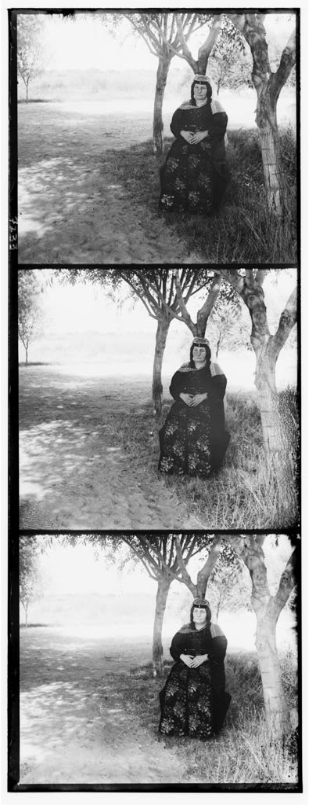
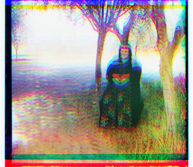
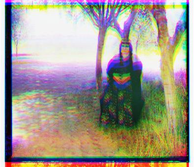
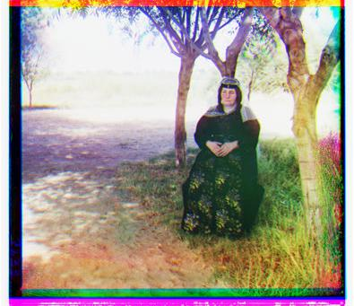
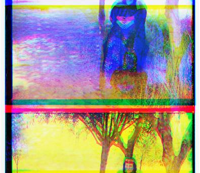

A script to automate Image Alignment and Color Compositing

## Challenge
Take a glass plate image as input and produce a single color image as output.

## Process
First step: Make the packages work.  I added

```python
from matplotlib import pyplot as plt
```
...because it worked better than scikit for me.  Also changed all the names of the files.  Next, I checked to see what the default case, of cutting the black and white image into thirds and dropping the pieces on each other would look like.

So here is our default case of just splitting the image into 3 equal parts.








Wow, maybe these really are colored photos. The blue is picked first so we will use that as the base layer so to speak.  It looks the green slide should get moved up a bit, and the red should get moved down some since I can see tree tops in the red section

```python
image[:, a] = np.roll(image[:, a], -1)
```

Should do the trick of shifting the image up a pixel in column ‘a’. To make this easier I made functions for up and down shifts. (slideUp(), and slideDown())

First I tried moving green up 10, and red down 5. Here’s the result of that:


We’re definitely on the right track. The plan now is to play around with the amount of sliding for this manual aligner.  I’m using the hands as my visual reference point because they are on a black background and it’s easy to see where the green hands, and red hands are.  You can kind of see the blue hands under them. So let’s lower the red a little bit more, and not raise the green quite as much to try and align on the blue hands.

After just a few iterations I was able to get a great image.  I think I was lucky to choose this one to start on since it seems that it didn’t need to be horizontally shifted or rotated much to make sense.

Green: up 2
Red: down 7
Blue: up 10



Now that I am convinced this is actually possible it’s time to automate it a bit.
The basic idea for lining up the images automatically is to be very greedy.  We will slide the layers around, calculate the Sum of squared differences between each layer.  Hopefully, when they are aligned this number will be quite low, and we pick our best one.

So here’s the meat of the algorithm. We let the image slide as much as 30 up or down. Then did some math.

```python
total_curr = np.sum( (temp_im1-image2) ** 2 )
```

This didn’t come out very well. My theory is that the border may be messing up my total.  The algorithm moved the red and the green layers up 25 pixels each.


