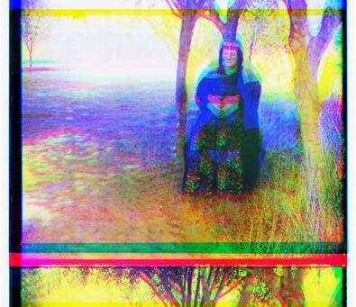

# Rgb-aligner
A script to automate Image Alignment and Color Compositing

## Challenge
Take a glass plate image as input and produce a single color image as output. 

## Process
First step: Make the packages work.  I added 

```python
from matplotlib import pyplot as plt
```
...because it worked better than scikit for me.  Also changed all the names of the files.  Next, I checked to see what the default case, of cutting the black and white image into thirds and dropping the pieces on each other would look like.

So here is our default case of just splitting the image into 3 equal parts.


